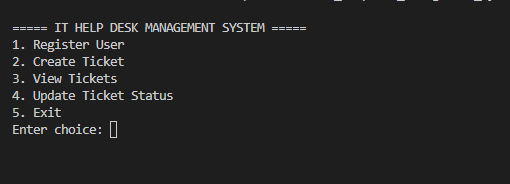
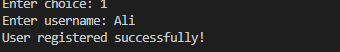
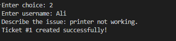
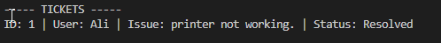
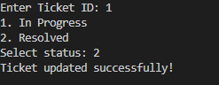

# 🖥️ IT Help Desk Management System


> A Python-based IT Help Desk ticketing system built as the **CompTIA IT Fundamentals (ITF+) Final Project**.
> Manages the full support ticket lifecycle — from creation to resolution — via a clean command-line interface.

---

## ✨ Features

| Feature | Description |
|---|---|
| 👤 User Registration | Register support staff and users |
| 🎫 Ticket Creation | Auto-generates unique ticket ID + timestamp |
| 📋 Ticket Tracking | View all tickets with current status |
| 🔄 Status Updates | Open → In Progress → Resolved workflow |
| 💾 Persistent Storage | Data saved to text files — survives restarts |
| 🖥️ CLI Interface | Clean, intuitive command-line menu |

---

## 📸 Screenshots

### Main Menu

> All 5 options displayed clearly — register, create, view, update, exit

### Register User

> New users registered and saved to `users.txt` instantly

### Create Ticket

> Auto-generates unique Ticket ID and timestamp on submission

### View Tickets

> All tickets displayed with ID, user, description, status and timestamp

### Update Ticket Status

> Search by Ticket ID and change status to In Progress or Resolved

---

## 🧠 How It Works

```
User opens app
      │
      ▼
┌─────────────────────┐
│      Main Menu       │
├─────────────────────┤
│ 1. Register User     │──► Saves to users.txt
│ 2. Create Ticket     │──► Saves to tickets.txt (auto ID)
│ 3. View Tickets      │──► Reads & displays all tickets
│ 4. Update Status     │──► Open → In Progress → Resolved
│ 5. Exit              │──► Closes program
└─────────────────────┘
```

---

## 📂 Project Structure

```
IT-HelpDesk-Management-System/
├── main.py              ← Main program
├── users.txt            ← Registered users (auto-created)
├── tickets.txt          ← All tickets (auto-created)
├── README.md            ← This file
└── screenshots/
    ├── menu.png
    ├── register_user.png
    ├── create_ticket.png
    ├── view_ticket.png
    └── update_ticket.png
```

---

## ▶️ How to Run

```bash
# 1. Make sure Python 3 is installed
python --version

# 2. Clone or download the project
git clone https://github.com/sharmeen-ai/IT-HelpDesk-Management-System

# 3. Navigate into the folder
cd IT-HelpDesk-Management-System

# 4. Run the program
python main.py
```

---

## 🛠️ Tools Used

- **Python 3** — core programming language
- **File I/O** — persistent text-based data storage
- **OOP & Functions** — clean, modular code structure
- **Visual Studio Code** — development environment

---

## 🏆 Skills Demonstrated

- 🖥️ **IT Support Concepts** — real-world help desk workflows
- 🔍 **Troubleshooting** — systematic issue tracking & resolution
- 💾 **Data Management** — file I/O and data persistence
- 🐍 **Python Fundamentals** — functions, loops, conditionals, file handling
- 🧩 **Problem Solving** — practical solution for a real-world scenario

---

## 🚀 Future Improvements

- 🔐 User Authentication (login/password protection)
- 🎨 GUI with Tkinter or PyQt
- 💾 Database Integration (SQLite or PostgreSQL)
- 📧 Email Notifications for ticket updates
- 📊 Analytics Dashboard
- ⏱️ Priority Levels (urgent, high, medium, low)
- 🔍 Search & Filter by status, user, or date

---

## 👤 Author

**Sharmeen Ahsan** — Python Developer | AI Enthusiast | Content Writer

📍 Rawalpindi, Pakistan
📧 sharmeens19@gmail.com
🐙 [GitHub](https://github.com/sharmeen-ai)
💼 Available for freelance work → [Hire me on Upwork](YOUR_UPWORK_LINK)

---

**Course:** CompTIA IT Fundamentals (ITF+)
**Last Updated:** June 2026
